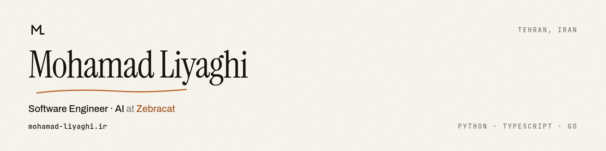

<picture>
  <source media="(prefers-color-scheme: dark)" srcset="assets/banner-dark.png">
  
</picture>

I build the systems that turn a prompt into a finished video — the job pipelines
underneath, the model steps in between, and the interface on top. Five years in
Python, backend-leaning full-stack, working from Tehran at
**[Zebracat](https://www.zebracat.ai)**.

- **Backend** — Python, Go, Django/DRF, FastAPI, Celery, RabbitMQ, asyncio
- **Models** — LLM APIs, structured output, tool calling, RAG, vector search
- **Frontend** — React, TypeScript, Tailwind, Remotion
- **Data & infra** — PostgreSQL, PostGIS, Redis, Elasticsearch, Docker, Kubernetes, AWS

## Open source

| Project | | |
| --- | --- | --- |
| **[FoodAnywhere](https://github.com/mohamad-liyaghi/FoodAnywhere)** | ★ 40 | Food-delivery backend. PostGIS for geospatial search, Celery for anything slow, and tracing that follows an order from the request to the worker that finishes it. |
| **[fast-commerce](https://github.com/mohamad-liyaghi/fast-commerce)** | ★ 22 | Async e-commerce backend built for throughput — clean API boundaries, background processing, and a test suite that gates deploys. |
| **[AcademyMaster](https://github.com/mohamad-liyaghi/AcademyMaster)** | ★ 21 | Academy-management API with layered permissions and scheduled background jobs. |
| **[Tsuna-Streaming](https://github.com/mohamad-liyaghi/Tsuna-Streaming)** | ★ 16 | Streaming backend for video and music, with the expensive processing pushed onto background workers. |
| **[telegram-to-rubika-uploader](https://github.com/mohamad-liyaghi/telegram-to-rubika-uploader)** | ★ 14 | Go tool that relays files up to 2 GB between two platforms, so people in Iran don't spend scarce VPN bandwidth re-uploading what they already sent. |
| **[FastQuora](https://github.com/mohamad-liyaghi/FastQuora)** | ★ 11 | Q&A platform on FastAPI. Elasticsearch for search, Redis for cache, distributed tracing through both. |
| **[iran-survival-pack](https://github.com/mohamad-liyaghi/iran-survival-pack)** | ★ 6 | Self-hosted calls, chat, files and a container registry, for collaborating over networks you can't rely on. |

## Writing

Long-form notes on building with language models — what they do once real traffic
reaches them.

- [Stop Being a Feature Factory: The Engineer's Other Job Is Reading the Money](https://medium.com/@el_mohamad/stop-being-a-feature-factory-the-engineers-other-job-is-reading-the-money-f95653b9c3ff)
- [Stop Being the Bottleneck: The Engineer's New Job in the Age of Coding Agents](https://medium.com/@el_mohamad/stop-being-the-bottleneck-the-engineers-new-job-in-the-age-of-coding-agents-9fb50db04d74)
- [Stop Being Your Product's Night Shift: How an Agent Squad Actually Works](https://medium.com/@el_mohamad/stop-being-your-products-night-shift-how-an-agent-squad-actually-works-9fb5b2f9718a)
- [Stop Treating Open Source Models as a Downgrade: How Model Routing Actually Works](https://medium.com/@el_mohamad/stop-treating-open-source-models-as-a-downgrade-how-model-routing-actually-works-3891150cbc97)
- [Stop Treating Embeddings as Meaning: How Vector Spaces Actually Work](https://medium.com/@el_mohamad/stop-treating-embeddings-as-meaning-how-vector-spaces-actually-work-c7a5240723cb)

Everything at **[medium.com/@el_mohamad](https://medium.com/@el_mohamad)**.

## Elsewhere

**[mohamad-liyaghi.ir](https://mohamad-liyaghi.ir)** · [LinkedIn](https://www.linkedin.com/in/mohamad-liyaghi/) · [Medium](https://medium.com/@el_mohamad) · [Telegram](https://t.me/El_mohamad) · [liaghimohamad69@gmail.com](mailto:liaghimohamad69@gmail.com)
